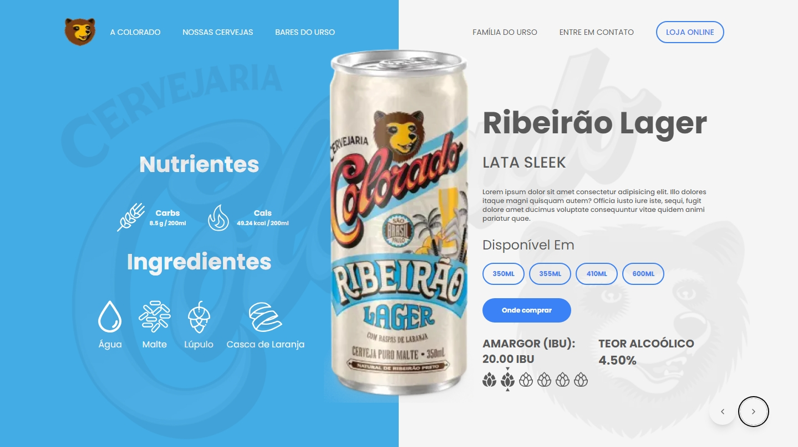

# Colorado Beers 🍻

Um projeto interativo que exibe uma variedade de cervejas artesanais da Colorado, permitindo que os usuários explorem diferentes estilos e sabores. Desenvolvido com React, Framer Motion, Tailwind CSS, Prisma e Neon, o projeto oferece uma experiência de usuário fluida e visualmente atraente, com integração de banco de dados moderna.

## 🚀 Live Preview

Confira o projeto em funcionamento: [Live Preview](https://colorado-beers.vercel.app/)

## 🛠️ Tecnologias Utilizadas

- **React**: Para a estrutura do projeto.
- **Framer Motion**: Para animações suaves e interativas.
- **Tailwind CSS**: Para estilização rápida e responsiva.
- **Vite**: Para um ambiente de desenvolvimento rápido e eficiente.
- **Prisma**: Para ORM e gerenciamento do banco de dados.
- **Neon**: Banco de dados serverless moderno e escalável.
